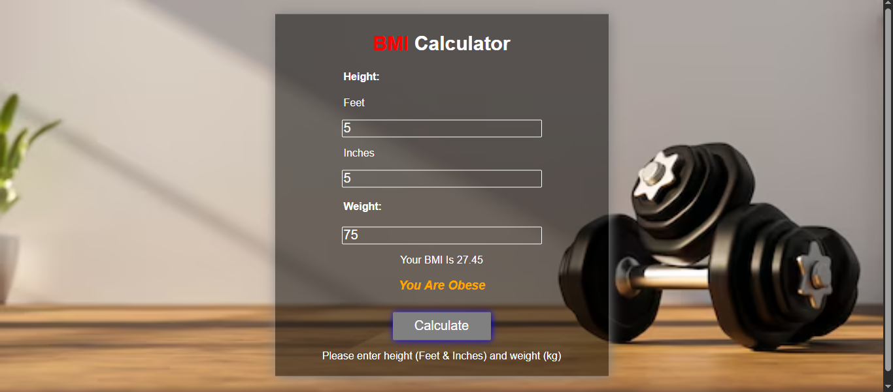

# ⚖️ BMI Calculator

A simple **BMI (Body Mass Index) Calculator** web application built using **HTML, CSS, and JavaScript**.

Users can input their **weight (in kg)** and **height (in feet and inches)**.  
The app converts the height to meters, calculates the BMI, and shows the result along with a category (Underweight, Normal, Overweight, or Obese).

## 🖼️ Screenshots

### 🔹 BMI Calculator - Correct

### 🔹 BMI Calculator - Obese

### 🔹 BMI Calculator - UnderWeight

## 🚀 How to Run the Project

- Clone or download the repository
- Open index.html in any modern web browser.   ## 🛠️ Technologies Used

- 🧱 HTML5
- 🎨 CSS3
- 🧮 JavaScript (DOM Manipulation)
